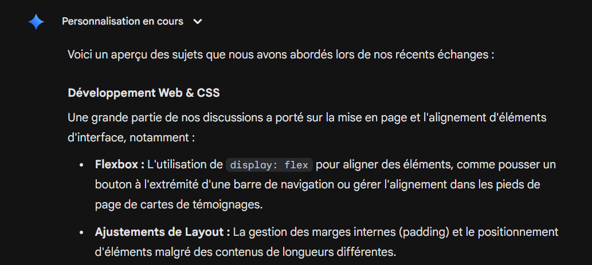

# Documentation pour mon Projet 1 en Web 2

## Système de nomenclature CSS

Je suis parti du principe que les premières, deuxièmes et dixièmes sections avaient besoin de leurs propres classes. Par la suite, en raison des fortes similarités de propriétés entre les différents éléments retrouvés dans les sections du milieu, j'ai décidé de généraliser les appellations que j'utilisais pour ces dernières (toujours démarrer chaque nouvelle section par la classe section). Ensuite, j'ai créé plusieurs modifiers. Les plus importants à expliquer sont les suivants : Le modifier --side, appliqué aux titres et aux conteneurs pour les sections en elles-mêmes, servait lorsque ces dernières affichaient, sur la maquette, une flex-direction en row (d'où l'appellation, puisque le texte se retrouve sur le côté plutôt qu'au centre). --square servait lorsque le conteneur d'une image devait prendre la forme d'un carré. --black signifie que le texte est en noir, ainsi de suite. Pour une question d'efficacité, j'ai, à plusieurs reprises, ajouté plusieurs classes à un même élément. Très souvent, il s'agissait des propriétés de base d'un composant déjà utilisé auparavant et auxquelles allaient s'ajouter les règles d'un modifier. Cela me permettait de ne pas avoir à répéter du code.

## Variables CSS et design tokens

Avant de nommer mes variables CSS ainsi que mes tokens, j'ai longuement analysé la maquette et ai, par la suite, pris la décision d'organiser mes variables de sorte à ce qu'elles se rapprochent le plus possible (sans non plus exagérer et aller chercher un 10.625rem d'espacement, par exemple, dans ce cas j'ai écris 10) des valeurs qui y reviennent le plus souvent. Par exemple, la valeur de ma variable --space-md est de 4rem puisqu'il est fréquent de voir des sections avec un padding de 3.75rem. Le but était simple : Limiter les exceptions. Je n'ai pas mis de variables pour des éléments qu'on ne retrouvait pas assez fréquemment sur la page, tels que des bordures.

## Composants réutilisables 

- Bouton call-to-action (Présent en haut et bas de page)

## Choix de fonctions CSS fluides 

- Aux lignes 213 et 235 de mon code CSS, clamp est utilisé pour assurer un réajustement fluide de la taille du bouton lorsque celle de la fenêtre est modifiée
- Aux lignes 484 et 495 de mon code CSS, j'ai employé calc pour maximiser l'espace que peut occuper le sous-titre car, avant cette manipulation, le texte basculait sur la ligne du dessous. J'ai donc rajouté white-space: nowrap puis ensuite cette commande, qui amène le conteneur à quelques pixels avant le début du padding, pour m'assurer que ce problème ne se reproduirait pas.
- À la ligne 670, correction d'un défaut créatif avec calc : En effet, le conteneur pour les boutons, avec sa largeure originale, dépassait celle du formulaire, donnant une apparence bâclée au layout. J'ai donc utilisé les pourcentages, puis ensuite les pixels (pour éviter de descendre encore et encore dans les valeurs décimales) pour aligner parfaitement la fin du conteneur avec le côté droit des labels du formulaire.

## Défis techniques rencontrés et solutions 

J'ai rencontré plusieurs problèmes au cours de la réalisation du TP1, en particulier en lien avec l'espacement. À plusieurs reprises, il arrivait qu'en prenant le CSS de la maquette et en le retranscrivant dans VSCode, les espacements étaient alors beaucoup plus importants qu'ils apparaissaient l'être sur la maquette. À chaque fois, j'ai réussi à régler le problème sans bidouiller, à l'exception d'une occasion où absolument rien ne fonctionnait, dans la section artistes. J'ai alors simplement créé une classe différente pour chaque image de la section et leur ai appliqué une marge négative pour faire remonter le texte, qui, pour une raison ou une autre, sortait de la carte. Ce n'est vraiment pas l'idéal, mais c'est la seule solution fonctionnelle que j'ai trouvé dans le contexte.

## Intelligence artificielle 

J'ai utilisé l'intelligence artificielle pour des problématiques qui n'avaient pas de solution évidente. C'est notamment grâce à mes échanges avec Gemini et CoPilot que j'ai découvert white-space: nowrap;, une propriété forçant une zone de texte à s'afficher sur une ligne (avant, j'essayais flex-wrap: nowrap et cela ne fonctionnait pas). J'ai aussi, pu, notamment, résoudre un problème d'alignement horizontal entre les deux articles dans la section témoignages. Voici un aperçu de mes conversations avec Gemini, fourni par Gemini lui-même.

